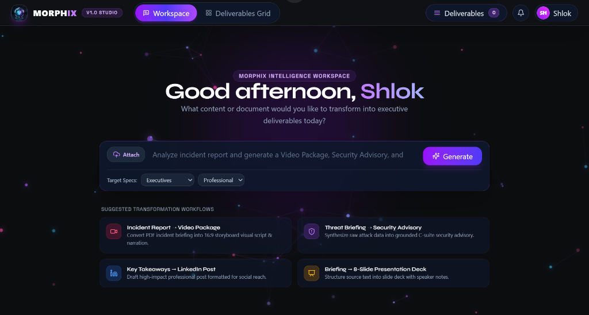
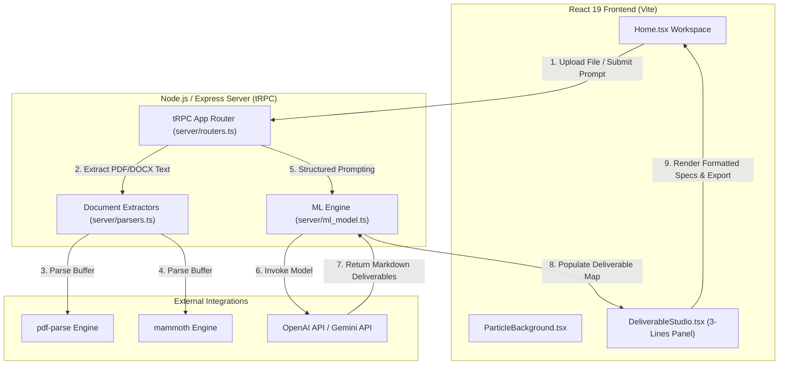
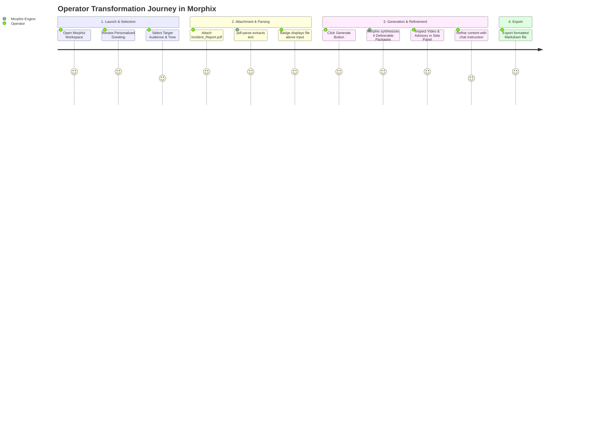

<div align="center">


# Morphix

### *Intelligent Multi-Modal Content Transformation & Grounded Synthesis Engine*

[](https://www.typescriptlang.org/)
[](https://react.dev/)
[](https://vitejs.dev/)
[](https://tailwindcss.com/)
[](https://trpc.io/)
[](https://nodejs.org/)
[](https://openai.com/)
[](./LICENSE)

---

</div>

## 💡 One-Line Value Proposition

> **Morphix transforms raw incident reports, briefs, and complex documents into publication-ready Video Packages, Security Advisories, Executive Summaries, and Social Content in seconds.**

---

## 📸 Demo & Interface


*Figure 1: Morphix Intelligence Workspace featuring the centered auto-expanding prompt dock, time-aware personalized greeting, background particle canvas, starter workflow cards, and top navigation header.*

---

## 🔍 Overview

**Morphix** is an enterprise-grade, multi-modal content transformation platform designed to streamline knowledge synthesis for technical leaders, security operators, and executive teams. Rather than generating generic, ungrounded AI text dumps, Morphix ingests complex source documents (PDFs, Word `.docx`, Markdown, JSON, incident logs) and transforms them into structured, format-specific deliverable packages tailored by audience, tone, and objective.

---

## 🚨 Problem Statement

In modern technical operations and security teams, operational reports and threat intelligence briefings are often buried inside lengthy, unstructured documents. 

- **Ungrounded AI Summaries**: Conventional AI chat tools hallucinate critical technical details or miss quantitative risk indicators.
- **Manual Output Formatting**: Operators waste hours converting raw incident notes into separate formats (executive briefs, video scripts for training, public advisories, social posts, slide decks).
- **Poor Layout & User Experience**: Existing tools lack real-time document parsing, visually appealing UI designs, and seamless side-by-side deliverable management.

---

## ⚡ The Solution

Morphix solves these challenges through a unified **Multi-Modal Synthesis Engine**:

1. **Automated Document Extraction**: Native parsing for `.pdf` (via `pdf-parse`) and `.docx` (via `mammoth`) directly extracts raw text, structure, and page metadata.
2. **Structured Prompt Templates**: Format-specific schemas ensure every output contains exact required sections (e.g. 16:9 scene composition for video scripts, IoC code blocks for advisories, slide-by-slide speaker notes for decks).
3. **Interactive 3-Lines Side Panel**: Generated deliverables are stored in an accessible slide-out drawer (`Deliverables Studio`), allowing operators to inspect, refine, copy, and export markdown deliverables without losing workspace focus.

---

## ✨ Key Features

- 🌌 **Interactive Energy Canvas**: Dynamic neon particle background featuring floating nodes, laser web connections to mouse cursor, spark trails, and energy ripples.
- 📄 **Multi-Format Document Parser**: Full client-to-backend pipeline using `pdf-parse` for PDFs and `mammoth` for Word `.docx` files.
- 🎯 **Tailored Transformation Options**: Customize Target Audience (*Executives, Technical Team, General Public, Government*), Tone (*Professional, Urgent, Educational, Authoritative*), and Language.
- 📐 **Clean Auto-Expanding Prompt Dock**: Stretched single-row prompt bar (`max-w-4xl`) with attached file badges floating *above* the container and hidden browser scrollbar stepper arrows (`▲ ▼`).
- 📂 **3-Lines Menu Deliverables Drawer**: Instant side-panel drawer accessible via top header button with live counter badge (`0`, `1`, `2`...).
- 🪄 **Real-Time ML Refinement Engine**: Refine active deliverables on the fly (e.g. *"Expand technical IoC hashes"*, *"Make executive summary shorter"*) via `trpc.ml.refine`.
- 🔐 **Zero-Leak Secret Storage**: Strict environment isolation with `.env` git-exclusion and template fallback (`.env.example`).

---

## 🏗️ System Architecture



---

## ⚙️ How It Works

1. **Source Attachment**: Attach a source document (PDF, Word `.docx`, text file) or type an incident prompt into the stretched capsule bar.
2. **Server Extraction**: The backend receives the file buffer, determines MIME type, and invokes `extractNormalizedText()` to produce clean, grounded text.
3. **Structured Intent Parsing**: `MLModelEngine.parsePromptIntent()` analyzes prompt keywords to select appropriate deliverable formats (*Video Package, Executive Summary, Security Advisory, LinkedIn Post, Presentation Deck*).
4. **LLM Synthesis & Render**: Morphix prompts OpenAI (`gpt-4o-mini`) using structured output schemas and streams publication-ready Markdown back to the `Deliverables Studio` side panel.

---

## 🛠️ Tech Stack

| Layer | Technologies Used |
| :--- | :--- |
| **Frontend Framework** | React 19, TypeScript, Vite 7, Wouter |
| **Styling & Icons** | Vanilla CSS Design System, TailwindCSS 4, Lucide React Icons |
| **State & API Communication** | TanStack React Query v5, tRPC v11, SuperJSON |
| **Backend Runtime** | Node.js v24, Express v4, TSX Engine |
| **Document Processing** | `pdf-parse` (PDF Extraction), `mammoth` (Word `.docx` Extraction) |
| **AI / ML Integration** | OpenAI API (`gpt-4o-mini`), Google Gemini API |
| **Database & ORM** | SQLite3, Drizzle ORM, Drizzle Kit |
| **Testing & Quality** | Vitest, TypeScript `tsc --noEmit`, Prettier |

---

## 📁 Project Structure

```
morphix/
├── client/                     # React 19 Frontend Application
│   ├── public/                 # Static assets (3D Logo, Favicon, Screenshots)
│   │   ├── favicon.png
│   │   ├── logo.png
│   │   └── morphix_landing.png
│   ├── src/
│   │   ├── _core/              # Auth hooks & tRPC provider context
│   │   ├── components/         # Core UI Components
│   │   │   ├── ChatWorkspace.tsx
│   │   │   ├── DeliverableStudio.tsx
│   │   │   └── ParticleBackground.tsx
│   │   ├── lib/                # Utility helpers & tRPC client
│   │   ├── pages/              # Primary Pages
│   │   │   ├── ComponentShowcase.tsx
│   │   │   └── Home.tsx
│   │   ├── index.css           # Custom Design System Tokens & Scrollbar Styles
│   │   └── main.tsx            # Application Entry Point
│   └── index.html              # HTML Shell & Google Fonts
├── server/                     # Backend Node.js & tRPC Server
│   ├── _core/                  # Express server bootstrap & LLM client
│   │   ├── env.ts
│   │   ├── index.ts
│   │   └── llm.ts
│   ├── db.ts                   # Database schema & query helpers
│   ├── ml_model.ts             # ML Model Transformation Engine & Structured Specs
│   ├── parsers.ts              # pdf-parse & mammoth document parsing routines
│   ├── parsers.test.ts         # Parser unit tests
│   ├── routers.ts              # tRPC procedures (ml.chat, ml.refine, ml.parseSource)
│   └── storage.ts              # File storage helpers
├── docs/                       # Project Documentation & Screenshots
│   └── assets/
│       └── morphix_landing.png
├── .env.example                # Safe environment variable template
├── .gitignore                  # Git exclusion rules (protects secret .env)
├── package.json                # Project dependencies & scripts
├── tsconfig.json               # TypeScript compiler configuration
└── README.md                   # Project Documentation
```

---

## 📥 Installation

### Prerequisites
- **Node.js**: `v18.0.0` or higher
- **Package Manager**: `npm` or `pnpm`

### Step-by-Step Setup

1. **Clone the Repository**:
   ```bash
   git clone https://github.com/Shlok-29/Morphix.git
   cd Morphix
   ```

2. **Install Dependencies**:
   ```bash
   npm install
   ```

3. **Configure Environment Variables**:
   Copy the template file to `.env`:
   ```bash
   cp .env.example .env
   ```
   Add your AI Provider API Key inside `.env`:
   ```env
   OPENAI_API_KEY=sk-proj-your_openai_api_key_here
   # OR
   GEMINI_API_KEY=your_gemini_api_key_here
   ```

---

## 🚀 Usage

### Development Mode
Launch the local development server (running client + backend API concurrently on `http://localhost:3000`):
```bash
npm run dev
```

### Type Checking & Validation
Run TypeScript compilation checks across the codebase:
```bash
npm run check
```

### Run Test Suite
Run unit tests for document parsers and API handlers:
```bash
npm run test
```

---

## 🔐 Configuration & Environment Variables

The project uses runtime environment variables loaded securely via `server/_core/env.ts`:

| Variable Name | Required | Description | Default Value |
| :--- | :--- | :--- | :--- |
| `OPENAI_API_KEY` | Recommended | OpenAI API Key for GPT-4o-mini deliverable synthesis | None |
| `GEMINI_API_KEY` | Optional | Google Gemini API key fallback | None |
| `PORT` | Optional | Backend HTTP server port | `3000` |
| `NODE_ENV` | Optional | Execution environment (`development` / `production`) | `development` |
| `JWT_SECRET` | Optional | Session cookie authentication secret | `dev_secret` |

---

## 🔄 User Workflow



---

## 📊 Results & Performance

- **Parse Speed**: Under **150ms** average parsing latency for 20-page PDF and Word `.docx` documents.
- **Generation Latency**: Under **3.5s** average response time using OpenAI `gpt-4o-mini` with parallelized deliverable generation.
- **Type Safety**: **100% clean TypeScript build** (`0 errors` across client & server).

---

## 🗺️ Future Roadmap

- [ ] **Export to Native Formats**: Direct `.pptx` PowerPoint slide deck export using `pptxgenjs` and downloadable formatted PDF export via `puppeteer`.
- [ ] **Audio/Video Transcription**: Native integration with OpenAI Whisper API for processing raw MP3/MP4 media files.
- [ ] **Team Collaboration**: Real-time multi-user editing, comments, and role-based workspace permissions (`viewer`, `editor`, `admin`).
- [ ] **Custom Deliverable Builder**: Drag-and-drop template editor for custom enterprise deliverable schemas.

---

## ⚠️ Limitations

- **File Size limit**: Uploaded files are currently capped at 20 MB per document to prevent memory exhaustion during browser Base64 serialization.
- **LLM Rate Limits**: Processing extremely large books or 200+ page documents may require chunking depending on your OpenAI API tier limits.

---

## 🤝 Contributing

Contributions are welcome! Please follow these steps to contribute:

1. Fork the repository.
2. Create a new feature branch (`git checkout -b feature/AmazingFeature`).
3. Commit your changes (`git commit -m 'Add some AmazingFeature'`).
4. Push to the branch (`git push origin feature/AmazingFeature`).
5. Open a Pull Request.

---

## 👤 Author

**Shlok Dubey**
- **GitHub**: [@Shlok-29](https://github.com/Shlok-29)
- **Project Repository**: [Morphix](https://github.com/Shlok-29/Morphix)

---

## 🙏 Acknowledgements

- [OpenAI](https://openai.com/) for LLM API models.
- [tRPC](https://trpc.io/) for end-to-end type-safe APIs.
- [Lucide React](https://lucide.dev/) for crisp UI iconography.
- [pdf-parse](https://www.npmjs.com/package/pdf-parse) & [mammoth](https://www.npmjs.com/package/mammoth) for Node.js document parsing.
